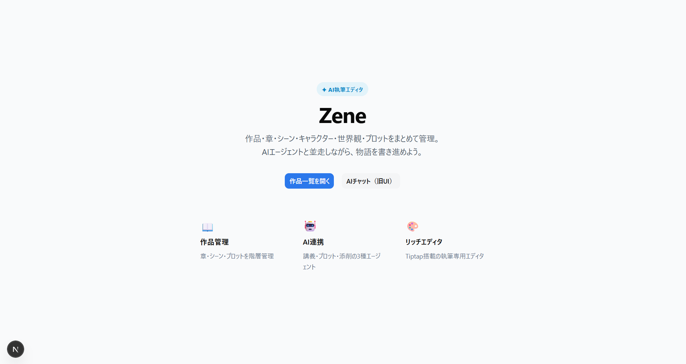
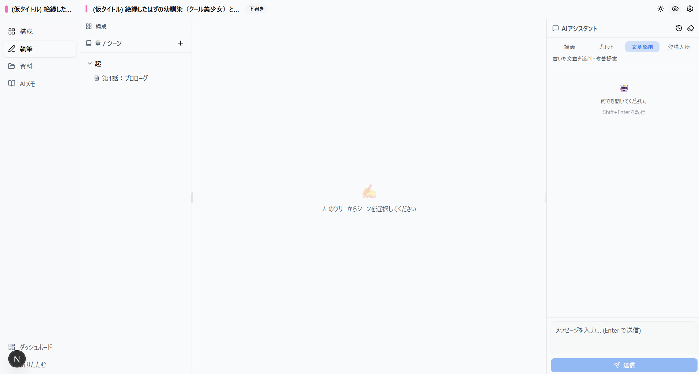
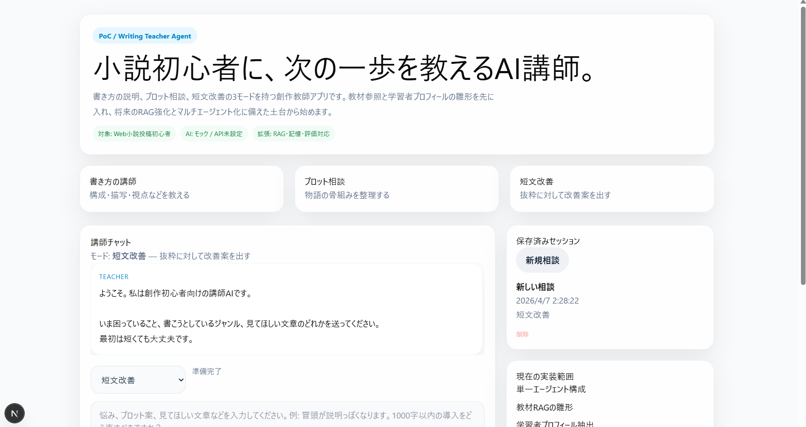

# 📚 Zene

AI × 執筆エディタ ツール「Zene」

<div style="display: flex; flex-wrap: wrap; justify-content: center; align-items: flex-start; gap: 16px;">
  <div style="display: flex; width: 100%; justify-content: center; gap: 16px;">
    
    
  </div>
  <div style="width: 100%; display: flex; justify-content: center; margin-top: 16px;">
    
  </div>
</div>


ユーザーは Zene 上で作品を書きながら、チャットで AI 講師に相談できます。チャットには、独自の資料を使ってRAGを導入済み。

## 作った経緯
「小説を書いてみたい」しかし、始め方が分からないし、本やネットで調べるのも手間がかかる。なら、AIと相談しながらエディタ上で執筆できないか？という思い付きという思い付きでこのアプリを開発しました。

このアプリは、他の小説執筆ツールと違って、AIツールとの連携を強化することに尽力しました。

OpenAIのgpt4.1miniモデルを使って独自のLLMモード（講師、プロット、文章添削、人物像）を作成し、連携させながら、独自のシステムプロンプトを設定して、AIの回答精度を上げました。
こうして、初心者でも小説の書き方や作法をAIを通して学べると思ったんですが、正直AIが出力する文章はそこまで品質が良くありません。（モデルにもよりますが）
それに、いざ小説を書こうとも、文章がまったく進まずに半ば諦めた状態になっていました。

将来的に小説執筆に特化したLLMモデルが誕生したら、このプロジェクトにまた着手するかもしれないけどまあ、そこまでのモチベが続くか分からない、というのが正直な感想です。

---

## 目次

1. [機能一覧](#機能一覧)
2. [アーキテクチャ](#アーキテクチャ)
3. [技術スタック](#技術スタック)
4. [ディレクトリ構成](#ディレクトリ構成)
5. [データベーススキーマ](#データベーススキーマ)
6. [セットアップ](#セットアップ)
7. [開発コマンド](#開発コマンド)
8. [評価パイプライン](#評価パイプライン)
9. [将来の拡張候補](#将来の拡張候補)
10. [注意点・既知の制約](#注意点既知の制約)

---

## 機能一覧

### AI 講師機能

| 機能 | 説明 |
|------|------|
| **4モードエージェント** | `lecture`（書き方教室）/ `plot`（プロット相談）/ `revision`（添削）/ `character`（キャラ設計）それぞれに専用エージェント |
| **RAG（意味検索）** | Vectra ベクタ DB によるコサイン類似度検索。API キー未設定時はキーワードフォールバック |
| **学習者プロフィール** | 会話からレベル・目標・弱点を自動抽出し SQLite に永続化。回答をパーソナライズ |
| **セッション管理** | UUID Cookie でのユーザー識別。セッション単位でチャット履歴を保存 |
| **モック応答** | `OPENAI_API_KEY` がない環境でも UI/フロー確認が可能 |

### Zene 執筆エディタ

| 機能 | 説明 |
|------|------|
| **プロジェクト管理** | 作品（タイトル・ジャンル・あらすじ・目標字数・ステータス）を複数管理 |
| **章・シーン管理** | 章→シーンの階層構造。各シーンが独立した Tiptap ドキュメント |
| **リッチテキストエディタ** | Tiptap v3 ベース。太字・斜体・下線・ハイライト・リンク・文字カラー・テキスト寄せ等 |
| **文字数カウント** | シーン・章・プロジェクト単位の字数を自動集計 |
| **キャラクター管理** | 役割・性別・年齢・性格・バックストーリー・特徴タグ・プロフィール画像など詳細管理 |
| **世界設定管理** | ロケーション / 文化 / 魔法体系 / テクノロジー / その他カテゴリで設定を整理 |
| **プロットポイント** | 全体プロット(global) / 章別プロット(chapter) スコープ。伏線・対立・クライマックス等タイプ分け |
| **プロットメーカー** | 話数×カテゴリのビジュアルカードボード。テンプレートキー対応 |
| **タイムライン** | トラック（伏線 / 解決 / キャラ / カスタム）× プロットポイントのマトリクス表 |
| **メモ機能** | プロジェクト内に Tiptap または プレーンテキストのメモをタグ付きで保持 |
| **プロジェクト内 AI チャット** | シーンに紐づけて AI チャットセッションを開始可能 |
| **自動保存** | `useAutosave` フックによる編集内容の自動保存 |

---

## アーキテクチャ

```text
ブラウザ (Next.js App Router / React 19)
    │
    ├─ /chat          スタンドアロン AI 相談UI
    ├─ /dashboard     プロジェクト一覧
    └─ /project/[id]  Zene 執筆エディタ
            ├─ /editor      Tiptap エディタ
            ├─ /structure   プロット / タイムライン / プロットメーカー
            └─ /materials   キャラクター / 世界設定

    │  API Routes (app/api/)
    ├─ POST /api/chat              AI 講師チャット
    ├─ GET/POST /api/projects      プロジェクト CRUD
    ├─ /api/projects/[id]/...      章・シーン・キャラ・世界設定・プロット CRUD
    └─ GET/POST /api/sessions      相談セッション管理

AI エージェント層 (lib/agent/)
    TeacherAgent (オーケストレーター)
        └─ AgentRouter → LectureAgent / PlotAgent / RevisionAgent / CharacterAgent
                            │
                            ├─ RAG 検索 (lib/rag/)  ← Vectra ベクタ DB
                            ├─ 学習者プロフィール (lib/memory/)  ← SQLite
                            └─ OpenAI API / モック

データ層
    SQLite + Drizzle ORM (lib/db/)
    Vectra ベクタインデックス (.vectra/)
```

---

## 技術スタック

| カテゴリ | 技術 |
|---------|------|
| フレームワーク | Next.js 16 (App Router) |
| UI ライブラリ | React 19, Tailwind CSS v4, shadcn/ui, Radix UI |
| エディタ | Tiptap v3 |
| LLM | OpenAI API (`gpt-4.1-mini` / `gpt-4.1`) |
| 埋め込みモデル | `text-embedding-3-small` |
| ベクタDB | Vectra (ローカルファイルシステム) |
| DB | SQLite + Drizzle ORM v0.45 |
| バリデーション | Zod |
| データフェッチ | SWR v2 |
| テスト | Vitest v4 |
| 言語 | TypeScript 5.8 |

---

## ディレクトリ構成

```text
app/
  api/
    chat/           AI チャット API
    projects/       プロジェクト & サブリソース CRUD API
    sessions/       相談セッション API
  chat/             スタンドアロン AI 相談ページ
  dashboard/        プロジェクト一覧ページ
  project/[id]/     Zene 執筆エディタ（editor / structure / materials）

components/
  chat/             チャットパネル
  editor/           Tiptap エディタ & ツールバー
  materials/        キャラクター・世界設定ビュー
  project/          サイドバー・プロジェクトカード
  structure/        プロット / タイムライン / プロットメーカービュー
  ui/               shadcn/ui コンポーネント群

lib/
  agent/
    agents/         LectureAgent / PlotAgent / RevisionAgent / CharacterAgent
    base.ts         Agent インターフェース
    router.ts       モード別ルーター
    teacher-agent.ts オーケストレーター
    system-prompt.ts システムプロンプト生成
    config.ts       モデル・パス設定
  rag/
    corpus.ts       KnowledgeChunk 教材定義（20+ チャンク）
    vector-store.ts Vectra ラッパー
    embedding.ts    OpenAI Embeddings ユーティリティ
    search.ts       ベクタ / キーワードフォールバック検索
  db/
    schema.ts       全テーブル定義（12 テーブル）
    client.ts       DB シングルトン
    *-repository.ts 各リソースのリポジトリ層
  memory/
    profile.ts      学習者プロフィール抽出
    store.ts        DB 永続化・マージ
  eval/
    dataset.ts      10件の構造化テストケース
    scorer.ts       5観点自動採点
    runner.ts       評価スイートランナー
  auth/
    user-id.ts      UUID Cookie ユーザー識別

scripts/
  db-migrate.ts     Drizzle マイグレーション実行
  seed-corpus.ts    コーパスをベクタインデックスに登録
  run-eval.ts       評価スイート実行

docs/
  project-plan.md       プロジェクト計画
  evaluation-rubric.md  5観点評価ルーブリック
  rag-guide.md          RAG 実装ガイド & 教材カタログ
  rag-corpus-policy.md  コーパス収録方針
  safety-policy.md      安全方針
```

---

## データベーススキーマ

SQLite + Drizzle ORM で管理。合計 **12 テーブル**。

| テーブル | 用途 |
|---------|------|
| `users` | UUID Cookie で識別する匿名ユーザー |
| `sessions` | AI 相談セッション（モード・メッセージ履歴） |
| `learner_profiles` | ユーザーごとのレベル・目標・弱点 |
| `projects` | 作品プロジェクト |
| `chapters` | プロジェクト配下の章 |
| `scenes` | 章配下のシーン（Tiptap JSON） |
| `characters` | キャラクター詳細 |
| `world_settings` | 世界設定（ロケーション / 文化 / 魔法体系 等） |
| `plot_points` | プロットポイント（全体 / 章別スコープ） |
| `plot_maker_cards` | プロットメーカー用カードボード |
| `timeline_tracks` | タイムライントラック行 |
| `timeline_cells` | タイムラインセル（トラック × プロットポイント） |
| `notes` | プロジェクト内メモ |
| `project_chat_sessions` | プロジェクト内 AI チャットセッション |

---

## セットアップ

### 前提

- Node.js 20 以上

### 手順

```bash
# 1. 依存関係インストール
npm install

# 2. 環境変数ファイルを作成（任意）
cp .env.local.example .env.local  # ファイルがなければ手動作成

# 3. SQLite データベース初期化
npm run db:migrate

# 4. コーパスをベクタインデックスに登録（OPENAI_API_KEY 必須）
npm run seed

# 5. 開発サーバー起動
npm run dev
```

### `.env.local` 設定値

```bash
# LLM（未設定ならモック応答で動作）
OPENAI_API_KEY=your_api_key
OPENAI_MODEL=gpt-4.1-mini

# 埋め込みモデル（未設定なら text-embedding-3-small）
EMBEDDING_MODEL=text-embedding-3-small

# 評価用ジャッジモデル
EVAL_JUDGE_MODEL=gpt-4.1
```

> `OPENAI_API_KEY` が未設定の場合、エージェントはモック応答を返すため、API なしで UI 確認が可能です。  
> ただし RAG のベクタ検索は実行されず、キーワードフォールバック検索になります。

---

## 開発コマンド

```bash
npm run dev          # 開発サーバー起動 (http://localhost:3000)
npm run build        # 本番ビルド
npm run start        # 本番サーバー起動
npm run typecheck    # TypeScript 型チェック
npm run db:migrate   # Drizzle マイグレーション実行
npm run seed         # コーパスをベクタ DB に登録
npm test             # Vitest ユニットテスト
npm run eval         # 5観点 LLM 自動採点スイート（OPENAI_API_KEY 必須）
```

---

## 評価パイプライン

`lib/eval/` に LLM-as-Judge パターンの自動評価パイプラインを実装しています。

### 5観点ルーブリック

| 観点 | 評価内容 |
|------|---------|
| **Clarity** | 初心者が理解できる語彙・説明か |
| **Actionability** | 次にやることが 1〜3 個の具体的な行動として示されているか |
| **Beginner Fit** | 高圧的・否定的でない指導トーンか |
| **Grounding** | 教材参照や学習者プロフィールが回答に活かされているか |
| **Copyright Safety** | 特定作品の模倣指示になっていないか |

### テストデータセット

`lib/eval/dataset.ts` に 10 件の構造化テストケースを定義。各ケースに入力メッセージと期待観点を記述し、ジャッジ LLM が 1〜5 点で採点します。

```bash
npm run eval
# → 結果は data/eval-results-YYYY-MM-DD.json に保存
```

---

## 将来の拡張候補

### エージェント・AI

- [ ] **LLM ベース意図判定ルーター** — ユーザーの発言から自動でモードを判定（現在は手動選択）
- [ ] **多段エージェント協調** — 講師エージェントが添削・プロット・キャラ各エージェントに委譲するオーケストレーション
- [ ] **長期記憶の強化** — 弱点パターンの時系列追跡や、前回セッションの文脈引き継ぎ
- [ ] **ユーザー別 RAG スコア** — 学習履歴に応じて教材の取得優先度を動的に変える
- [ ] **Fine-tuning 対応** — 評価データを蓄積して指導品質のファインチューニングに活用

### RAG・教材

- [ ] **教材チャンク拡充** — 難易度別・ジャンル別（ラノベ / 一般文芸 / ホラー等）の教材追加（[rag-guide.md](docs/rag-guide.md) 参照）
- [ ] **読者層別出し分け** — 初心者 / Web 投稿者 / 商業志望のプロフィールに合わせた教材フィルタ
- [ ] **外部 RAG サービス移行** — Pinecone / Azure AI Search 等のスケーラブルなベクタ DB への差し替え
- [ ] **ナレッジグラフ** — 教材チャンク間の関連（例：「視点のぶれ」→「地の文描写」）をグラフ化してコンテキスト精度を向上

### Zene エディタ

- [ ] **リアルタイム AI コーチ** — エディタ上の文章をバックグラウンドで解析し、インラインで改善提案を表示
- [ ] **差分レビュー表示** — 添削前後の diff 表示機能
- [ ] **章・シーンの移動 / 並び替え** — ドラッグ＆ドロップによる章ツリー操作
- [ ] **プロットメーカーテンプレート** — 三幕構成・起承転結・ヒーローズジャーニー等のビルトインテンプレート
- [ ] **エクスポート機能** — プレーンテキスト / Markdown / EPUB / PDF への書き出し
- [ ] **ルビ・傍点** — Web 小説向け Tiptap 拡張

### インフラ・認証

- [ ] **認証基盤** — 現在は UUID Cookie の匿名ユーザーのみ。NextAuth.js / Clerk 等への移行
- [ ] **クラウド DB** — Turso (libSQL) / PlanetScale 等への移行でマルチデバイス対応
- [ ] **ファイルストレージ** — キャラクタープロフィール画像の実 URL 保存（現在は文字列プレースホルダー）
- [ ] **WebSocket / SSE** — ストリーミング応答への対応（現在は完全応答後に表示）

---

## 注意点・既知の制約

### API・コスト

- `npm run eval` は GPT-4.1 でのジャッジを 10 ケース実行するため、API コストが発生します
- `npm run seed` は埋め込み API を呼び出します（コーパスサイズに比例したコスト）
- `OPENAI_API_KEY` を設定しない場合、モック応答と Vectra キーワード検索のみで動作します

### セッション・ストレージ

- **セッションデータ** : SQLite に常時保存され、ブラウザ再訪問時に復元されます
- **アップロード画像** : 現在はプレースホルダー文字列。実装時は S3 等のクラウドストレージが必要
- **ログイン情報** : UUID Cookie のみ保持。ブラウザのクッキー削除で匿名性がリセットされます

### API コスト目安

- **1 回の講師チャット** : トークン数に応じて $0.001〜$0.01 程度
- **1 回の埋め込み生成** (`seed`)  : コーパスサイズに応じて $0.001〜$0.05
- **1 回の eval 実行** (10-case) : GPT-4.1 ジャッジで $0.05〜$0.10 程度

### ローカル専用設計

- SQLite と Vectra はローカルファイルシステムに保存されます（`.sqlite` / `.vectra/`）
- 現在はマルチユーザー / マルチデバイス対応を想定していません
- セッション情報はサーバー再起動後も保持されますが、Next.js のビルドキャッシュには含まれません

### 安全方針

- 著作権上リスクのあるリクエスト（特定作品の模倣・再現）に対しては代替提案を返すよう評価ルーブリックで管理しています
- 詳細は [`docs/safety-policy.md`](docs/safety-policy.md) を参照してください

### Tiptap v3 互換性

- `@tiptap/*` パッケージはすべて v3 系で固定されています。v2 系とは API 互換性がありません

### マイグレーション

- DBスキーマを変更した場合は `npm run db:migrate` を再実行し、`drizzle/` 配下のマイグレーションファイルをコミットしてください
- `scripts/`: seed-corpus / db-migrate / run-eval
- `docs/`: 企画・安全性・評価の文書


## 次の実装候補

- ベクタDB導入によるRAG強化 ✅ 実装済（Vectra）
- ユーザー単位メモリのサーバー永続化 ✅ 実装済（SQLite + Drizzle）
- マルチエージェント分割 ✅ 実装済（Agent インターフェース + Router）
- 評価データセットと自動採点 ✅ 実装済（LLM-as-judge + Vitest）
- 各エージェントへの文章生成機能の追加 ✅ 実装済（2026-04-08）
- ストリーミング応答対応
- 難易度別コーパス分岐
- CI での eval パイプライン自動実行

---

## 変更履歴

### 2026-04-08 — 4エージェントへの文章生成機能追加

各エージェントのシステムプロンプト（`SYSTEM_BASE`）と出力形式を拡張し、文章生成機能を追加しました。  
`AgentContext` / `callChatCompletion` の型変更なし。プロンプト修正のみで対応しています。

#### 変更内容

| エージェント | ファイル | 追加された生成機能 |
|---|---|---|
| **LectureAgent** | `lib/agent/agents/lecture-agent.ts` | 改善ポイントごとに **Before/After例文を必ず生成**。Beforeは意図的なNG例、Afterで改善版を提示し、違いを体感的に理解させる |
| **CharacterAgent** | `lib/agent/agents/character-agent.ts` | ユーザーが設定シートを希望したとき・初回紹介時に **キャラクター設定シート**（欲求 / 恐れ / 信念 / 口癖 / 外見メモ）を生成 |
| **PlotAgent** | `lib/agent/agents/plot-agent.ts` | プロット改善案の提示後、**シーン冒頭の叩き台（200字以内）** を生成。「続きはご自身でどうぞ！」の一言を添えて依存を防止 |
| **RevisionAgent** | `lib/agent/agents/revision-agent.ts` | ユーザーが「全文リライトして」など**明示的に希望した場合のみ**全文を出力。末尾に「⚠️ これはあくまで参考例です。自分の言葉で書き直してみることで、より大きな成長につながります。」の注意書きを必須化 |

#### 設計方針

- **学習効果優先** — 全文生成はオプション扱いとし、基本は1〜2点の部分改善に留める
- **依存防止** — 全文リライト・叩き台生成には必ず注意書きを付与する
- **後方互換性** — 既存の `AgentContext` 型・`callChatCompletion` シグネチャを変更しない
- **推奨導入順序** — リスクの小さい LectureAgent（例文生成）から始め、RevisionAgent（全文リライト）を最後に位置づけた
